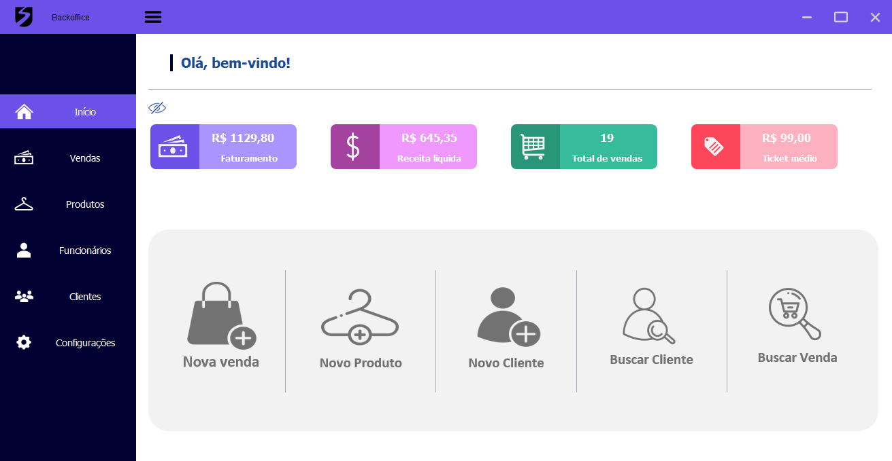
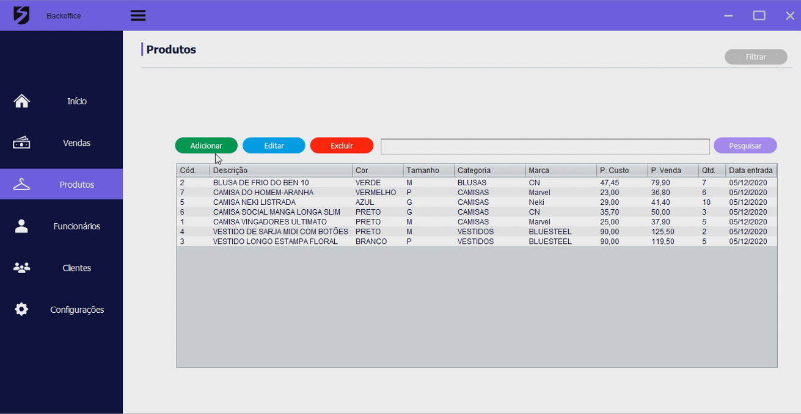
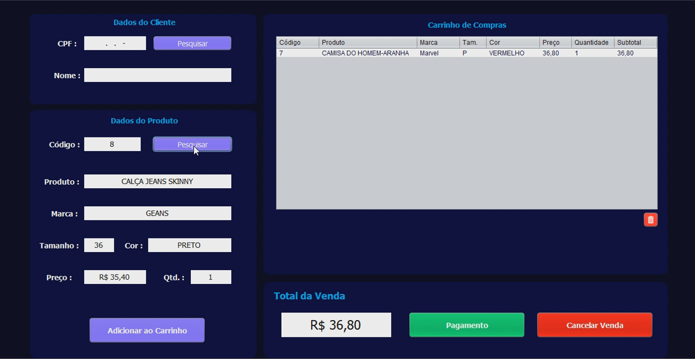
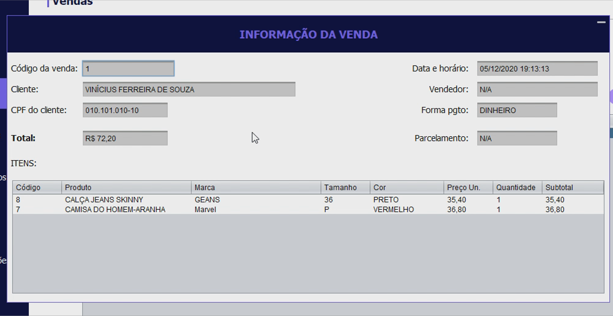
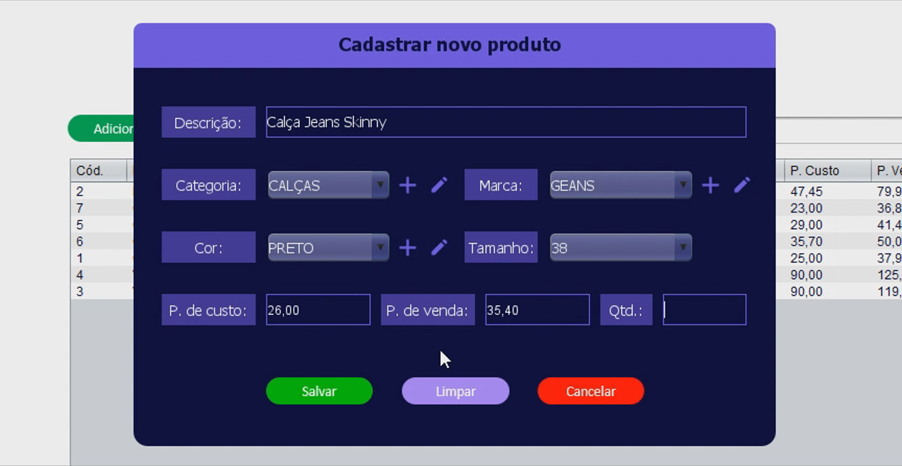
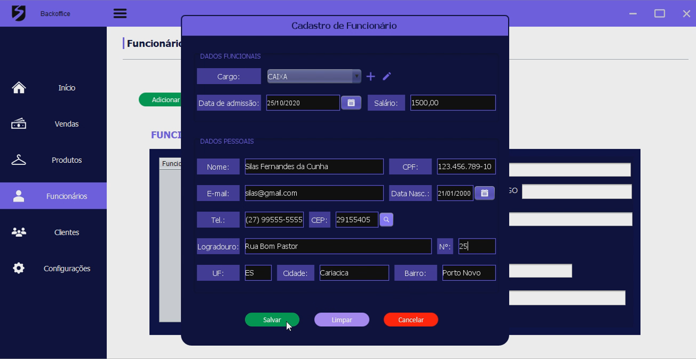
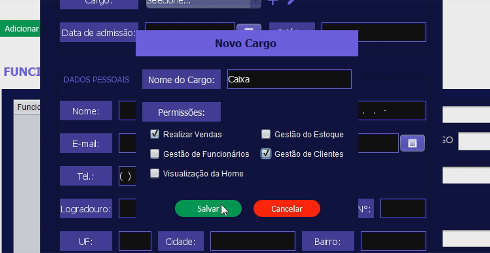

# Sistema de Gestão para Lojas de Roupas
Este sistema foi um projeto desenvolvido no curso de Tecnologia em Análise e Desenvolvimento de Sistemas no segundo período na UniSales de Vitória - ES.

O desafio do Projeto Integrador de Extensão II era desenvolver um protótipo de sistema comercial para pequenos empreendimentos, utilizando a linguagem de programação Java, juntamente com o Swing para construir as telas, e o banco de dados NoSQL Nitrite. Nós optamos, então, por desenvolver um sistema para gestão de lojas de roupas, onde focamos apenas nas funcionalidades necessárias para que isso fosse possível, sendo um sistema intuitivo e de fácil uso. No fim, nosso projeto foi selecionado e premiado como um dos melhores do curso e tivemos nosso vídeo de apresentação do projeto exibido em uma mostra pública da faculdade. [Link do nosso video de apresentação](http://mostravirtual.unisales.br/curso/sistema-de-gestao-para-lojas-de-roupa/).

Grupo:
- [Lucas de Almeida Sarmento](https://github.com/Lucas-Almeida-Sar);
- [Marcos Daniel Mateus e Coelho](https://github.com/barvous);
- [Mariana Guimarães Jardim](https://github.com/MarianaGJ);
- [Silas Fernandes da Cunha](https://github.com/silascunha);
- [Sthefano Garcia Pícoli](https://github.com/steuf0);
- [Vinícius Ferreira de Souza](https://github.com/vfdesouza).

**Para utilizar o sistema é necessário fazer um login, utilizando 'admin' como usuário e senha.**

## Algumas telas do sistema

### Tela inicial (Home)

### Tela de login

### Tela de produtos

### Tela de vendas

### Tela de informações de vendas (a partir do histórico)

### Tela de cadastro de novos produtos

### Tela de cadastro de funcionários

Um login é gerado com o email e o CPF, e o funcionário terá restrições no sistema de acordo com o cargo.

### Tela de cadastro de cargos (onde é possível selecionar as permissões no sistema)

